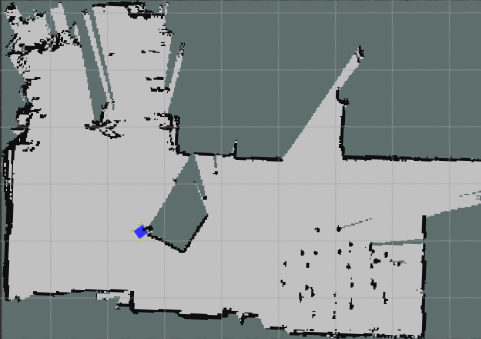
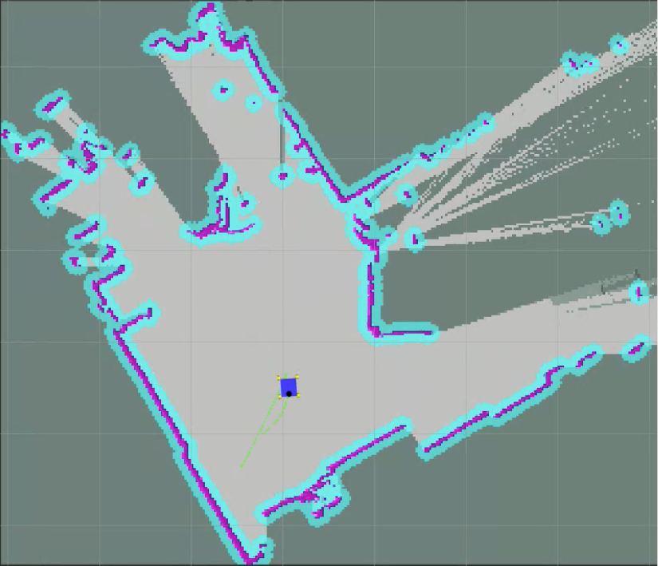
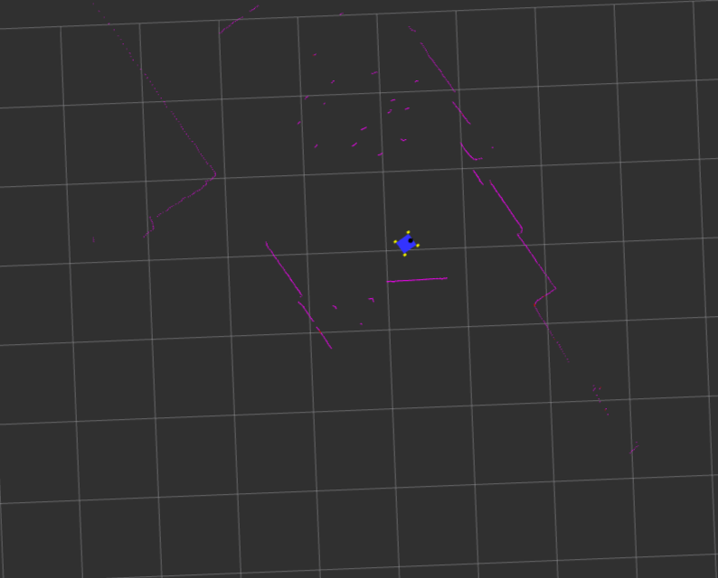

# Icarus 🪽

If you're new here, check out the [README](https://github.com/Ikaros-Robotics/icarus_pi) in my parent repo for more information on the project! 

This repository contains the code and information on how to run SLAM and Nav2 on your robot to enable autonomous navigation capabilities. Additionally, we have provided support for adding a Raspberry Pi camera to your robot.

 
 

## Initial run

    sudo apt install ros-foxy-slam-toolbox ros-foxy-navigation2 ros-foxy-nav2-bringup

>Follow LiDAR Setup on https://github.com/Slamtec/rplidar_ros/tree/ros2-devel (Make sure to add the udev rule for the LiDAR)

 
 

## To run Autonomy Stack

>In Simulation

    ros2 launch autonomy autonomy_sim_launch.py

>On Robot

    ros2 launch autonomy autonomy_launch.py

 
 

## To launch only SLAM Toolbox

>In Sim
    
    ros2 launch slam_toolbox online_async_launch.py params_file:=./src/autonomy/config/mapper_params_online_async.yaml use_sim_time:=true

>On Robot

    ros2 launch slam_toolbox online_async_launch.py params_file:=./src/autonomy/config/mapper_params_online_async.yaml use_sim_time:=false

 
 

## To launch only Nav2

>In Sim

    ros2 launch nav2_bringup navigation_launch.py params_file:=./src/autonomy/config/nav2_params.yaml use_sim_time:=true

>On Robot

    ros2 launch nav2_bringup navigation_launch.py params_file:=./src/autonomy/config/nav2_params.yaml use_sim_time:=false

 
 

## To launch only the Physical LiDAR

    
    ros2 launch rplidar_ros rplidar_a1_launch.py

 
 

## To Launch only the camera

>CAMERA PUBLISHER

    ros2 run camera_publisher cam_pub

>LOCAL CAMERA SUBSCRIBER

    ros2 run camera_publisher cam_sub

 
 

## References:

- [Nav2 Official Documentation](https://docs.nav2.org/)
- [Slam Toolbox Github](https://github.com/SteveMacenski/slam_toolbox)
- [Slamtec RPLiDAR Github](https://github.com/Slamtec/rplidar_ros)
- [Xubuntu 20.04 Custom Jetson Nano Image](https://forums.developer.nvidia.com/t/xubuntu-20-04-focal-fossa-l4t-r32-3-1-custom-image-for-the-jetson-nano/121768?page=7)
- [Articulated Robotics - Build a Mobile Robot with ROS](https://articulatedrobotics.xyz/tutorials/mobile-robot/project-overview)
- [TurtleBot3 Documentation](https://emanual.robotis.com/docs/en/platform/turtlebot3/overview/#turtlebot3)
